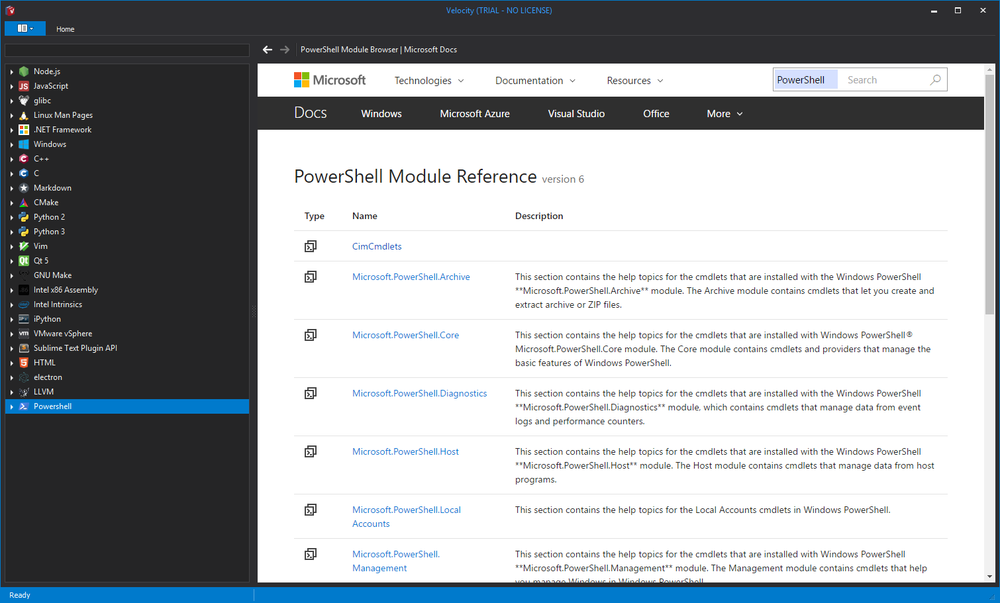

# powershell-docset : A dash docset for powershell modules

### Status

`posh-to-dash.py` scrapes the newly announced `https://docs.microsoft.com/en-us/powershell/module/` website in order to create an offline dash-compatible archive to be viewed in `Dash`, `Zeal` or `Velocity` :

## Releases

- [v0.1 -- Minimal working version](https://github.com/lucasg/powershell-docset/releases/tag/v0.1)
- [v0.2 -- Offline mode supported](https://github.com/lucasg/powershell-docset/releases/tag/v0.2)
- [v0.3 -- travis setup](https://github.com/lucasg/powershell-docset/releases/tag/v0.3)
- [v0.4 -- user contributed docset](https://github.com/lucasg/powershell-docset/releases/tag/v0.4)
- [v0.5 -- versionned docsets](https://github.com/lucasg/powershell-docset/releases/tag/v0.5)
- [v0.6 -- windows 10 modules documentation](https://github.com/lucasg/powershell-docset/releases/tag/v0.6)
- [v0.7.2 -- powershell 7.1 documentation](https://github.com/lucasg/powershell-docset/releases/tag/v0.7.2)

## Installation & Execution

`posh-to-dash.py` relies on :

- `requests` for http(s) downloads
- `selenium` and `phantomjs` for webscraping
- `bs4` for html parsing and rewriting

1. Copy the repository
2. Install the dependencies from requirements.txt, use a virtualenv to avoid problems with dependencies and versions.
3. Download the geckodriver from [Mozilla's Repo](https://github.com/mozilla/geckodriver/releases), download the version that matches your OS.
4. Place the geckodriver in your path

- If Windows, grab the executable an place it in `%USERPROFILE%\AppData\Local\Microsoft\WindowsApps`

- If Linux, move it to your `~/.local/bin` or wherever you have your path

5. Start scraping by typing : `posh-to-dash.py --output=$outputfile --version=6 --temporary`

- if `--output` is not provided, `posh-to-dash.py` will output "Powershell.tgz' into the working directory
- the `--version` switch support only Powershell API versions `7.0`, `7.1` (default) and `7.2` , the rest are obsolete by Microsoft.
- `--temporary` specify to download the web scraping resources in a temporary folder instead of clobbering the current directory. However if the download fail, the results will be thrown out.

**NOTE: The process takes 15+ minutes to run. The more versions you download increases the time.**

## Add your docset to Zeal

With the Powershell.tar file, unzip it and place it in `C:\Users\<your-username>\AppData\Local\Zeal\Zeal\docsets`

## Limitations

The powershell modules API endpoint is quite new, so it may be subject to breakage by the `docs.microsoft.com` people.
